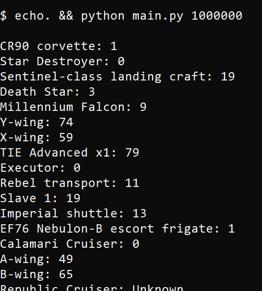
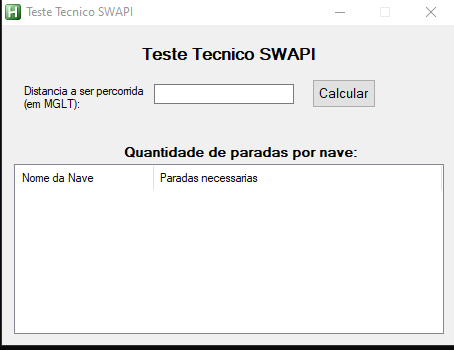

# Teste Tecnico de Desenvolvedor
## Autor: Luan Fellipe (allen08)

### Descrição: Calcular Nº de paradas necessárias para percorrer uma distância com cada espaçonave da API SWAPI

### [ * ] Requisitos necessários (CLI):
  - S.O: Windows (7 ou superior), Linux ou MacOS
  - Software Necessário: python3.5 ou superior
  - Biblioteca requests (instalar: pip install requests)

### [ * ] Requisitos necessários (GUI):
  - S.O: Windows (7 ou superior)
  - Software Necessário para execução pelo código fonte: AutoHotKey (Instalação: https://www.autohotkey.com)
  - Biblioteca requests (instalar: pip install requests)

### [ * ] Como Utilizar (CLI):
  - Opção 1: Executar o script main.py na linha de comando (Terminal ou CMD) e em seguida, digitar a distância no programa
    - ex: python3 main.py
  - Opção 2: Executar o script main.py na linha de comando (Terminal ou CMD) com a distância sendo passada como parâmetro para o script
    - ex: python3 main.py 1000000
  
### [ * ] Como Utilizar (GUI):
  - Executar o programa .exe (ou .ahk se o AutoHotKey estiver instalado na máquina)
  - Informar a distância a ser percorrida no campo de edição
  - Clicar no botão para ser realizado o cálculo

### [ * ] Exemplo de Execução (CLI):

### [ * ] Exemplo de Execução (GUI):

